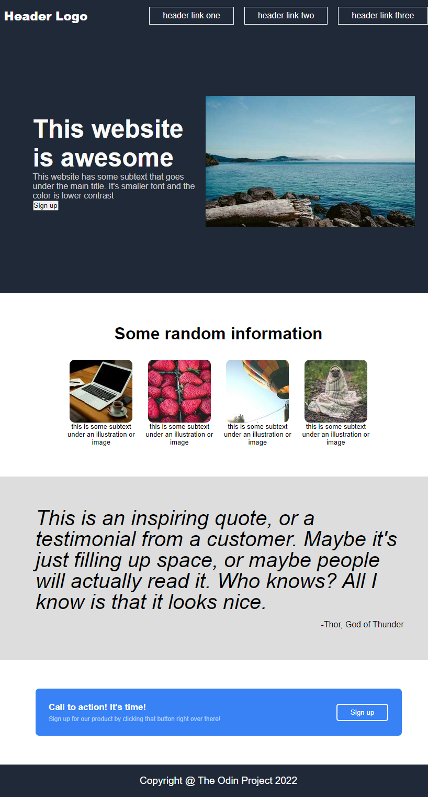

# TOP LANDING PAGE

> A landing webpage built using CSS flexbox, typography and semantic HTML.



## Built With

- HTML5 elements
  - Semantic elements such as `footer`, `header` and so on,
- CSS properties
  - CSS Positioning `fixed`,
  - CSS Variables for reusable CSS values,
  - Typography such as `font-size`, `font-weight` and so on,
  - CSS Background for page aesthetic using `background-color`,
  - CSS Media Query for page responsiveness using `@media` rule,
  - CSS flexbox such as `justify-content`, `align-items` and so on.
- Linters
  - [Prettier](https://prettier.io/),
  - [Stylelint](https://stylelint.io/).
- GitHub Action

## Live Demo

[Live Demo Link](https://top-add-landing-page.netlify.app/)

### Development (Running locally)

- Clone the project

```bash
git clone https://github.com/moshoodabdullahi/top-landing-page.git
```

- Install Dependencies

```bash
yarn install
```

To run StyleLint by itself, you may run the lint task:

```bash
yarn lint:check
```

Or to automatically fix issues found (where possible):

```bash
yarn lint
```

You can also check against Prettier:

```bash
yarn format:check
```

and to have it actually fix (to the best of its ability) any format issues, run:

```bash
yarn format
```

You can also check against webhint:

```bash
yarn hint
```

## Design Mockups

|                                                                       Full Design                                                                        |                                                                       Color and Fonts                                                                        |
| :------------------------------------------------------------------------------------------------------------------------------------------------------: | :----------------------------------------------------------------------------------------------------------------------------------------------------------: |
|  |  |

## Style Guides

- [CSS Style Guide](http://udacity.github.io/frontend-nanodegree-styleguide/css.html)
- [HTML Style Guide](http://udacity.github.io/frontend-nanodegree-styleguide/index.html)
- [Git Style Guide](https://udacity.github.io/git-styleguide/)

## 👤 Author

- Github: [@moshoodabdullahi](https://github.com/moshoodabdullahi)
- Linkedin: [@moshoodabdullahi](https://www.linkedin.com/in/moshoodabdullahi/)

## 🤝 Contributing

Contributions, issues and feature requests are welcome!

Feel free to check the [issues page](../../issues).

## Show your support

Give a ⭐️ if you like this project!

## Acknowledgments

- [TheOdinProject](https://www.theodinproject.com/paths/foundations/courses/foundations)

### Image Credit

- [Photo by Olga Lioncat from Pexels](https://www.pexels.com/photo/modern-skyscrapers-near-calm-river-7245326/)
- [Photo by Lachlan Ross from Pexels](https://www.pexels.com/photo/rocky-cliff-washed-by-stormy-sea-on-gloomy-weather-7084179/)
- [Photo by Michael Burrows from Pexels](https://www.pexels.com/photo/rocky-coast-of-wavy-ocean-7147865/)
- [Photo by Maria Orlova from Pexels](https://www.pexels.com/photo/rocky-cliff-above-azure-sea-4913429/)
- [Photo by Rachel Claire from Pexels](https://www.pexels.com/photo/stony-coastline-near-rippling-sea-4992762/)

## 📝 License

[MIT licensed](./LICENSE).
